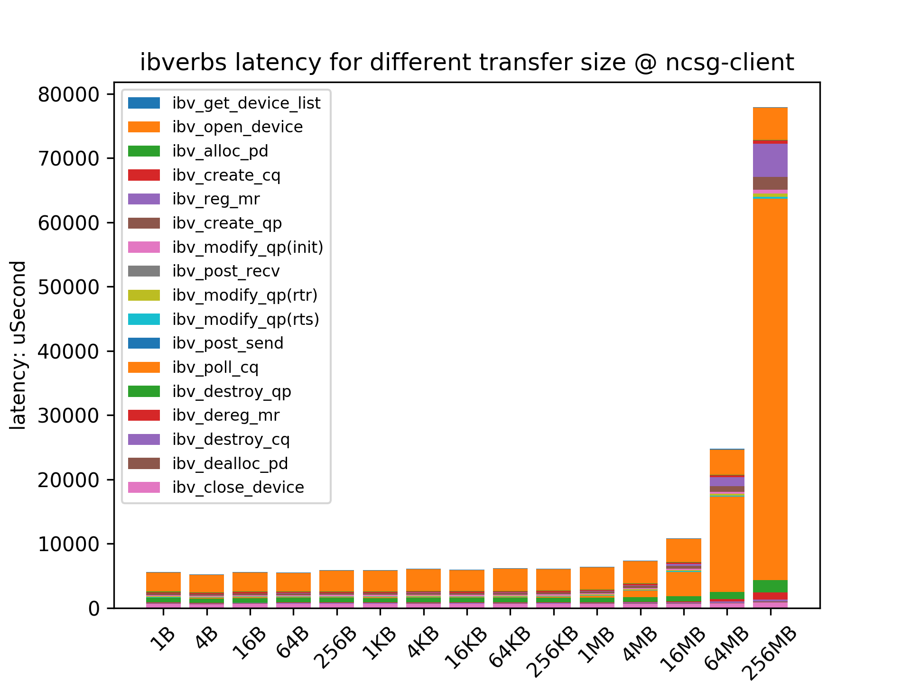
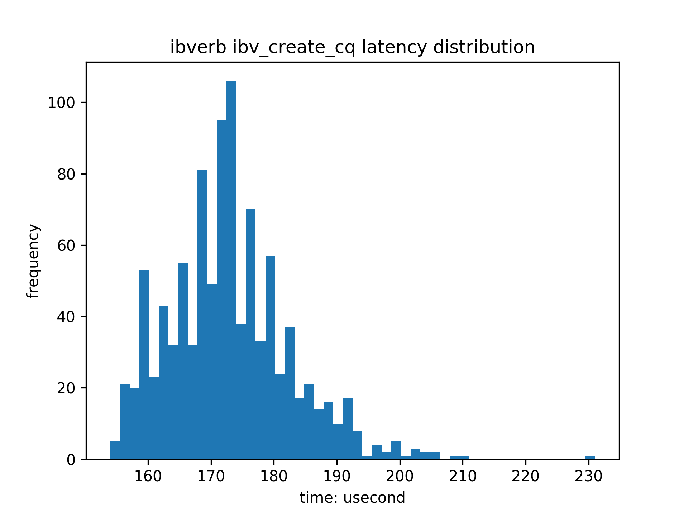

# RDMA ibverbs benchmark
RDMA test case and benchmark.

Author: hurray0@qq.com

## Benchmark HOW_TO_USE
### help
```bash
./benchmark.sh -h
```

### args description
* `-M` maximum data size, default: 268435456(256MB)
* `-m` minimum data size, default: 1(1B)
* `-p` multiple factor for size, default: 4
* `-l` loop number (iteration number), default: 1000
* `-n` log unique name, default: timestamp
* `-P` server port, default: 19875
* `-I` server ip
* `-d` mellanox HCA (ib dev)
* `-g` IB gid index if using RoCE, default: -1(IB) 
* `-s` whether it is the server

### exmample
```bash
# server
./benchmark.sh -n first -s

# client
./benchmark.sh -n first -I 172.16.13.217
```

### result
The result include detaild ibverbs latency statistics, and some image to provide better view.
For example:





## RDMA Base Command

* `ibstat` can show the status of IB Host Channel Adapter (HCA), which means whether the NIC channel is linked and can be used.

```txt
$ ibstat
CA 'mlx5_0'
        CA type: MT4115
        Number of ports: 1
        Firmware version: 12.28.1002
        Hardware version: 0
        Node GUID: 0x248a070300b1bc04
        System image GUID: 0x248a070300b1bc04
        Port 1:
                State: Active
                Physical state: LinkUp
                Rate: 100
                Base lid: 0
                LMC: 0
                SM lid: 0
                Capability mask: 0x00010000
                Port GUID: 0x268a07fffeb1bc04
                Link layer: Ethernet
CA 'mlx5_1'
        CA type: MT4115
        Number of ports: 1
        Firmware version: 12.28.1002
        Hardware version: 0
        Node GUID: 0x248a070300b1bc05
        System image GUID: 0x248a070300b1bc04
        Port 1:
                State: Down
                Physical state: Disabled
                Rate: 10
                Base lid: 2
                LMC: 0
                SM lid: 1
                Capability mask: 0x2651e84a
                Port GUID: 0x248a070300b1bc05
                Link layer: InfiniBand
```

* `show_gids` can view the GID and ROCE version of each HCA.

```txt
$ show_gids
DEV     PORT    INDEX   GID                                     IPv4            VER     DEV
---     ----    -----   ---                                     ------------    ---     ---
mlx5_0  1       0       fe80:0000:0000:0000:268a:07ff:feb1:bc04                 v1      ens11f0
mlx5_0  1       1       fe80:0000:0000:0000:268a:07ff:feb1:bc04                 v2      ens11f0
mlx5_1  1       0       fe80:0000:0000:0000:248a:0703:00b1:bc05                 v1
n_gids_found=3
```

